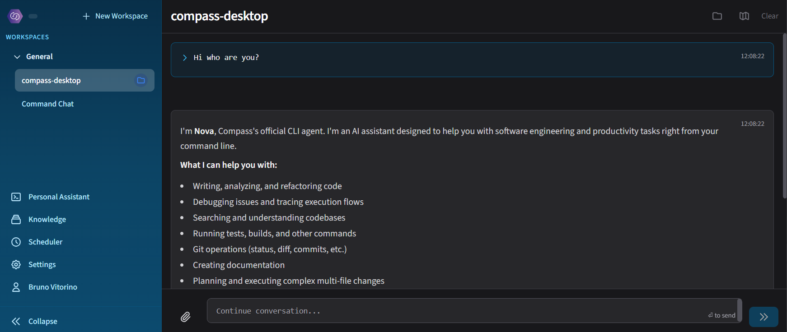

# Compass Desktop

<div align="center">



**The native desktop experience for the Compass Platform — AI-powered development, right on your machine.**

[](https://github.com/Compass-Agentic-Platform/compass-desktop/releases)
[](https://www.electronjs.org/)
[](LICENSE)

</div>

---

## ⚡ Quick Start

Download the latest installer for your platform from the [releases page](https://github.com/Compass-Agentic-Platform/compass-desktop/releases) and log in with your [Compass Platform](https://compassap.ai) account.

> **Need the CLI?** Install [Nova](https://www.npmjs.com/package/@compass-ai/nova) first — Compass Desktop uses it as its AI engine.

---

## 🌟 The All-In-One AI Development Platform

Compass Desktop is the **native GUI companion** to the Compass Platform ecosystem:

| Platform Component | Description |
|-------------------|-------------|
| 🖥️ **Desktop App** | Full GUI experience — chat, scheduler, marketplace, knowledge base |
| 🌐 **Web Platform** | Access your projects from anywhere |
| 💻 **CLI (Nova)** | Terminal-first power user experience |
| 📊 **Excel Add-In** | Transform how your organisation works with spreadsheets |

**One subscription. Four ways to work. Complete flexibility.**

---

## 🚀 Why Compass Desktop?

Compass Desktop brings the full power of the Compass AI Platform to a native application — no browser tabs, no copy-pasting, no context switching. Everything you need to build, automate, and manage your AI-assisted workflows lives in one place.

| Feature | Compass Desktop | Typical AI Tools |
|---------|----------------|-----------------|
| **Native Performance** | Electron app | Browser-dependent |
| **Persistent AI Sessions** | ACP mode — zero cold-start latency | Stateless per-request |
| **WhatsApp Control** | Chat with your AI agent from your phone | Desktop-only |
| **Cron Scheduler** | Runs `Schedule.md` tasks automatically | Manual execution only |
| **Marketplace** | Install agents & skills from GitHub/Azure DevOps | No ecosystem |
| **Knowledge Base** | RAG-powered document search | None |
| **Audit Logging** | SQLite-backed searchable history | None |
| **Secure Credentials** | OS-level keychain (never plain text) | Config files |
| **Cross-Platform** | Windows, macOS, Linux | Varies |

---

## ✨ Key Features

### 💬 Chat-Based AI Interface

Talk to your AI agent in a familiar chat UI backed by a full embedded terminal. Real-time output streams directly into the conversation — no waiting for the whole response before you see results.

```
You: Refactor the authentication module to use JWT tokens

→ Analyses current implementation
→ Creates secure JWT-based auth
→ Updates all dependent files
→ Preserves backward compatibility
→ Output streams line by line as it happens
```

### ⚡ ACP Mode — Persistent AI Connection

The **Agent Client Protocol (ACP)** replaces per-message process spawning with a single persistent `nova --acp` connection. The result: near-zero latency between messages, shared session context, and consistent tool availability.

```
┌─────────────────────────────────────────────────────────┐
│  SDK Mode (default)                                     │
│  → Spawns a new Nova process per message (~0.5–1.5s)   │
│                                                         │
│  ACP Mode (experimental)                                │
│  → Persistent connection, ~0ms overhead per message     │
│  → Shared session state across the whole conversation   │
│  → Tool call visualisation with approval dialogs        │
└─────────────────────────────────────────────────────────┘
```

Enable ACP per-chat from the chat settings — you can mix modes across different conversations.

### 📱 WhatsApp Integration

Control your AI agent from your phone. Send a message from WhatsApp and get the full CLI response back — including file attachments, streamed output, and context continuity with your desktop session.

- **Secure**: Only your authorised phone number can send commands
- **Persistent auth**: Scan the QR code once; stays connected across restarts
- **Full feature parity**: Everything available in the desktop chat works over WhatsApp
- **Media support**: Send images, documents, or code files as attachments

### 🕐 Cron Scheduler Daemon

Compass Desktop automatically runs scheduled tasks defined in `Schedule.md` files — the same files that Nova creates when you ask it to set up recurring tasks.

```markdown
| Enabled | Cron Expression | Task              | Description               |
|---------|----------------|-------------------|---------------------------|
| [x]     | `0 9 * * 1-5`  | `npm test`        | Run tests weekday mornings |
| [x]     | `*/30 * * * *` | `npm run lint`    | Lint every 30 minutes      |
| [ ]     | `0 0 * * 0`    | `git gc`          | Weekly garbage collection  |
```

The scheduler watches your project directories for `Schedule.md` changes and reconciles jobs automatically — no restart needed.

### 🛒 Marketplace Browser

Discover and install agents, skills, and plugins from curated sources — public GitHub repositories or private Azure DevOps repositories with PAT authentication.

- Browse by category, search by keyword
- Preview agent and skill definitions before installing
- Install individual agents or entire plugin packages
- Manage exclusions to hide plugins you don't need
- Real-time installation progress with per-file feedback

### 🧠 Knowledge Base Management

Upload documents to your Compass knowledge buckets and query them with AI-powered RAG search — all from the desktop app.

- Create and manage personal or organisational buckets
- Upload PDFs, documents, and text files
- Share buckets with team members
- Auto-generated questions for each document

### 🛠️ Compass Resource Editor

Browse and edit your `.compass` project resources — agents, skills, commands, MCP server configs, memory files, and rules — in a dedicated panel with a built-in editor.

```
.compass/
├── agents/          → Define specialised AI agents
├── skills/          → Reusable AI capabilities
├── commands/        → Custom slash commands
├── .mcp.json        → MCP server configurations
├── MEMORY.md        → Persistent agent memory
└── RULES.md         → Project-level instructions
```

### 🔒 Security First

```
┌─────────────────────────────────────────────────────────┐
│  Command Whitelist                                      │
│  → Only whitelisted commands can be executed            │
│                                                         │
│  Directory Whitelist                                    │
│  → Restrict execution to specific directories           │
│                                                         │
│  Approval Dialogs                                       │
│  → Confirm tool calls before they run (ACP mode)       │
│                                                         │
│  OS-Level Credential Storage                            │
│  → Windows Credential Manager / macOS Keychain /       │
│    Linux Secret Service — never stored in plain text    │
└─────────────────────────────────────────────────────────┘
```

**Additional safeguards:**
- Context isolation enabled for all renderer processes
- Node integration disabled in renderer (contextBridge only)
- Content Security Policy enforced for all web content
- Argument sanitisation via `shell-quote`
- Up to 10 concurrent commands with configurable timeouts

### 📋 Audit Log Viewer

Every command execution is recorded in a local SQLite database. Search, filter, and export your full command history.

- Filter by source (local, remote, CLI), exit code, date range
- Full output capture with configurable retention (default: 90 days)
- Export to CSV or JSON for compliance or analysis
- Storage capped at a configurable maximum size

### 🌐 Proxy Support

Works out of the box in corporate environments:

- Automatic system proxy detection
- Manual HTTP/HTTPS and SOCKS5 configuration
- Per-host bypass rules

---

## 🎯 Use Cases

### AI-Assisted Development
```
Chat: "Find all files that handle user authentication"
→ auth.service.ts (primary)
→ jwt-utils.ts (utility)
→ middleware/auth.ts (middleware)
→ tests/auth.spec.ts (tests)
```

### Automated Workflows
```
Schedule: Run tests every morning at 9am on weekdays
→ Add a row to Schedule.md
→ Compass Desktop picks it up automatically
→ Results logged to execution history
```

### Mobile AI Access
```
WhatsApp: "What's the status of the CI pipeline?"
→ AI agent checks your project, responds to your phone
→ Context shared with your desktop session
```

### Knowledge-Powered Queries
```
Upload your architecture docs to a knowledge bucket
→ Ask questions in chat
→ AI answers with citations from your own documents
```

### Agent & Skill Management
```
Browse marketplace → Install "code-review" plugin
→ Agents and skills appear in your .compass folder
→ Use immediately in any chat
```

---

## 🖥️ System Requirements

| | Minimum |
|--|---------|
| **Windows** | Windows 10/11 (x64) |
| **macOS** | macOS 12+ (x64, Apple Silicon) |
| **Linux** | Ubuntu 20.04+ LTS (x64) |
| **Node.js** | v18.0.0+ (for Nova CLI) |

---

## 🏆 Why Teams Choose Compass Desktop

> "The ACP persistent connection is a game-changer — no more waiting half a second between every message. It feels instant."
> — Full-Stack Developer

> "WhatsApp integration means I can trigger my AI agent from my phone while I'm away from my desk. It's surprisingly useful."
> — Senior Engineer

> "The marketplace makes it trivial to share agents and skills across the whole team. One install, everyone benefits."
> — Tech Lead

> "Having the scheduler built into the desktop app means my automated tasks actually run — not just exist as documentation."
> — Platform Engineer

---

## 🔗 Links

- [Compass Platform](https://compassap.ai/)
- [Nova CLI](https://www.npmjs.com/package/@compass-ai/nova)
- [Releases](https://github.com/Compass-Agentic-Platform/compass-desktop/releases)
- [Report Issues](https://github.com/Compass-Agentic-Platform/compass-desktop/issues)
- [Documentation](https://docs.compassap.ai/desktop)

---

<div align="center">

**Ready to bring the Compass Platform to your desktop?**

[Download Compass Desktop](https://github.com/Compass-Agentic-Platform/compass-desktop/releases) → [Get Compass Platform](https://compassap.ai/)

</div>

---

*Compass Desktop — Native power for the Compass Platform ecosystem.*

Date: 2026-03-03

---

Co-authored by [Nova](https://www.compassap.ai/portfolio/nova.html)
